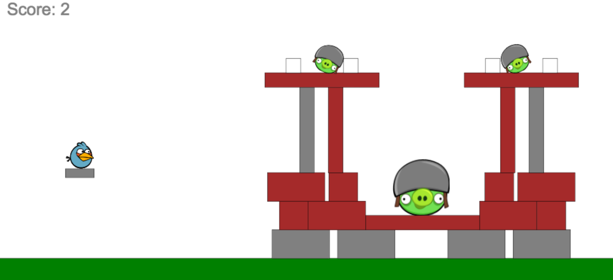
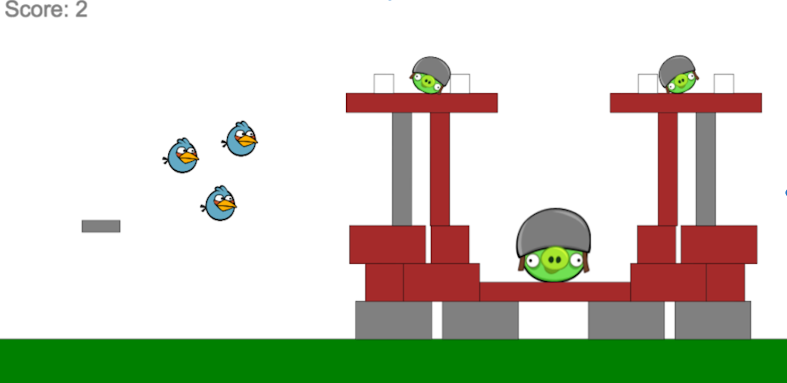
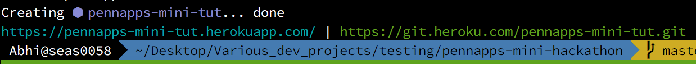

# PennApps-Mini-Hackathon: Angry Birds

A mini-project for a mini-hackathon


## Overview


This is a very basic implementation of Angry Birds in JavaScript. Currently, the implementation features several basic abilities of the 'Angry Birds' game including the ability for birds to have special abilities (e.g. this implementation has a default ability for the blue bird to split into 3). Also there are multiple block types and of course the pigs, all of which break in response to collisions. 

Currently Boxbox is being used to calculate the physics with javascript and handle collision logic. The app uses webpack to condense all the JavaScript files inside of the `components/` directory to the single `app.js` file. The `lib/` directory contains the scripts which the physics rely upon. The `styles/` directory includes a basic style sheet.

This write up was made for PennApps XIV by Abhinav Suri as part of the mini-hackathon program. The aim of this project is to provide a base for beginner/intermediate programmers to implement some new features on top of an existing codebase.

## Setup


We assume you have some knowledge of command line. Please install Node so you can get access to npm. 

After installing node, download this repository and run `npm install` to get all the dependencies this project requires onto your local machine. We will be using some ES6 in this project as appropriate (the boxbox physics simulator has a lot of parts that are still only ES5 compatible right now). 

After that you can run `npm run start:dev` to start a webpack build and load the page. You should see a working implementation at localhost:8080 or whatever the equivalent is for your computer.

Also note that `npm run build` will condense all the app files into the single `app.js` file. This should only be run at the end.

## Part 1: index.html and `<canvas>`

First if you haven't used HTML before, go ahead and move over to Codecademy's excellent HTML, CSS, and JS tutorials. 

Our webpage is incredibly simple. Most of our work will be done inside of a `<canvas>` element.

```html
<canvas id="game" width=1400 height=900>
    Text that you see if you don't support Canvas :(
</canvas>
```
In browsers < IE 8, the `<canvas>` element does not appear due to the fact that those versions did not support HTML5 at the time. So, any text within a canvas will not show on any modern browsers, but will show on browsers that have canvas elements hidden/disabled or browsers that are old and not updated to handle HTML5 tags.

Looking at `index.html` we can see the canvas element is the only part of the page and it takes up a large part of it. There are certainly ways to adaptively size a canvas, but those can just make it complicated to position elements. 

Note we also include the `app.js` script even though all the scripts that we actually code are within the `components` folder. This is because, while we are running `npm run start:dev`, we are actually getting files dynamically packaged from webpack-dev-server. I'll discuss this more later on. But basically the app.js file isn't updated until you ask it to be with a `npm run build`.

The other tags on this page are rather self explanatory and it is a fairly bare page, but more than enough for what we need.

## Part 2: Webpack

Since our webapp will be dealing with multiple components, it is best to deal with a single tool to dynamically require in scripts dealing with different parts of application logic. **Webpack** is what allows us to do this. We do need to worry about import order etc. and can require 3rd party scripts into our application. It can also process ES6, the newest version of JavaScript. 

You can view the `webpack.config.js` file to look along with this.

The context and resolve keys basically specify that all 'require's are made from the root of the current working directory (i.e. where the application lives). The `entry` key specifies the first JavaScript file you need to process and which will require all the other files you need.

`output` specifies that all of this javascript will be moved to the current directory and 'compiled' into the `app.js` file. 

The `module` key specifies specific configuration about how the webpack should handle interpretting files that you have required into your scripts. For example, we will be writing parts of our code in ES6 to utilize the convenience features such as `map()` and arrow functions. However, most web browsers fail to correctly interpret ES6 yet, so we specify a `loader` called **babel** which will transpile our code from ES6 -> ES5 (the current version of JavaScript universally supported as of Sept 10 2016).

The process of transpiling code, requiring it in the right order, and then moving it into the right order is very resource intensive and time consuming. So we will use a tool called `web-dev-server` to allow us to _hot-reload_ our file (i.e. as we save a file, it will be merged with a state tree and only the changes that we actually need will be made rather than remaking the entire file). So as we save our work, the changes will instantaneously reappear in the web browser.

## Part 3: Planning the Game

On the high level, we define what we want to make in order to have a clear goal in mind while programming. In the game of angry birds, at the most level, there are `birds` with different abilities which can have some abilities which clicked. There are also different types of `blocks` with differing level of 'life' and they break under certain amounts of force. There are also `pigs` which `birds` can break and must break to win the game. We can also have a `ground` component which will be a static platform that hold everything else.

On a lower level. The `birds` must have a lot of the same characters. They definitely have a x and y coordinate, some velocity, an image to represent it, some force at which it will break, some radius and so on. So it would make sense for our implementation to have separate `sprites` for each of the objects mentioned above.

We must also keep some kind of scoring component in order to quantify how well we did in the game. We won't go too much into how score should be determined, but the more pigs you destroy, the higher your score should be.

## Part 4: Physics with Boxbox

In order to not have to deal with the nitty-gritty of physics and collisions, we are going to be a lightweight javascript physics library called `boxbox.js`. All characters in our game are going to be objects in a boxbox world. This world has things like gravity, collisions, and so much more (much like real life). Additionally, Boxbox can take in a common set of characteristics and a set of custom characteristics and merge them together to form an object. This is incredibly useful for creating a new type of bird. Or some new ability a bird can have.

## Part 5: Main.js part 1

Look under components and go to `Main.js`. This is the entry point of our application. At the very top we import a ton of files.

``` javascript
import $ from 'jquery';

require("script!lib/Box2dWeb-2.1.a.3.min.js");
require("script!lib/boxbox.min.js");

import { getDist, getDegrees } from 'components/helpers.js';

import { createBird, birdConfig } from 'components/sprites/Bird.js';
import { createGround, groundConfig } from 'components/sprites/Ground.js';
import { createBlock, blockConfig } from 'components/sprites/Block.js';
import { createPig, pigConfig } from 'components/sprites/Pig.js';

```

Note here we are using the ES6 import syntax. We are explicitly requiring Boxbox and its dependency, Box2dWeb, because it is not a CommonJS module since it has not been updated in a while. But this is fine, we can just add it into our files by requiring the script with a !script before its name and `webpack` will recognize to insert these scripts in your app.js file, but not try to bundle them. Also note that the typical syntax for imports in ES6 is `import { function1, function2, ... } from 'filePathOrModuleName';`.

Next we declare some constants: 

```
let anchorX, anchorY, mouseX, mouseY = 0;
const PLATFORM_X = 3;
const PLATFORM_Y = 6;
const SCALE = 45;
```

The anchor cooridates and the mouse coordinates are tracked later on for our usage when creating a projectory vector visualization when a user drags their mouse across the screen to sling the bird to the other side. The platform variables tell us where the launch platform should be placed. 

The SCALE variable will be used in setting up our world. The `boxbox` system does all its measurements in meters. The Scale specifies the ratio of pixels to meters. For most of our boxbox position, we will use the meter representation of the objects in the boxbox world. 

## Part 6: Main.js part 2

We will be breaking down the next few parts of code in this section.

```javascript
$(document).ready( () => {

  let canvasElem = document.getElementById("game");
  let ctx = canvasElem.getContext('2d');
  canvasElem.width = window.innerWidth;
  canvasElem.height = window.innerHeight;
  ...
```
This code will get our canvas element from html (we called it #game by id). We then get the context aka `ctx` of the canvas so we can then perform basic drawing operations on the canvas itself. Lastly, we change the canvas width and height to the width and height of the current browser window. It would be necessary to create a resize function if you want this canvas to be resize, especially on smaller devices.

```javascript
  /** WORLD SETUP **/

  window.world = boxbox.createWorld(canvasElem, {
    collisionOutlines: false,
    $score: 0,
    scale: SCALE
  })
  
  window.world.onRender(function (ctx) {
    ctx.font = "20pt Arial";
    ctx.fillText("Score: " + this._ops.$score, 20, 20);
    if ( anchorX && anchorY && mouseX && mouseY ) {
      ctx.beginPath();
      ctx.moveTo(PLATFORM_X * SCALE, ( -bird._ops.radius + PLATFORM_Y ) * SCALE);
      ctx.lineTo(PLATFORM_X * SCALE + (anchorX - mouseX), PLATFORM_Y * SCALE + (anchorY - mouseY));
      ctx.stroke();
    }
  });
```

This piece of code explicitly creates the boxbox world. We specify a **custom variable with a $variableName** with an explicit requirement of the '$' to prepend the variable name. Note that we assign this to the variable called `window.world` which is stored in our global `window` object in the web browser. So our world is in turn stored in the window of the web browser which is good. The `.onRender ...` specifies that the `function (ctx) {...` must be called every single time the world is rendered which happens very very frequently. In this case, if the anchor and mouse points are not null, we then draw the current score of the game. We then draw a line with origin at the x and y coordinates specified in the moveTo method call and the lineTo method to draw the end of the line.
  
```javascript

  window.world.onTick( function() {
    let foundEls = window.world.find(1, 2, 5, 8);
    let found = false;
    for (var i = 0; i < foundEls.length; i++) {
      if (foundEls[i]._name === 'bird') {
        found = true;
      } else {
      }
    }
    if (found === false && birdArr.length > 0) {
      birdObj = birdArr.pop();
      bird = createBird.bind(window)(birdObj.type, birdObj.x, birdObj.y,birdObj.canSplit);  
    }
  });
```


This piece of code also adds functionality to the world. Every time there is a game tick (aka every 50 ms), we call the `world.find()` in the callback function. The find method will take 4 parameters and return a list of objects within the box bounded by those for coordiates. This is useful for determinining if the bird has left a platform or not. If it has, then we look at our birdArr (we will see this later...but basically it contains all the information we need to construct birds in an array form i.e. 1 bird = 1 array entry) and pops a value off the array which is then created and bound to the window.

```javascript
  /** CLICK LISTENER SETUP **/

  $('#game').on('mousedown', function(e) {
    anchorX = e.offsetX;
    anchorY = e.offsetY;
    $(this).on('mousemove', function (move) {
      mouseX = move.offsetX;
      mouseY = move.offsetY;
    });
  }).on('mouseup', function(e) {
    $(this).unbind('mousemove');
    var dist = getDist(anchorX, anchorY, mouseX, mouseY);
    var degrees = getDegrees(anchorX, anchorY, mouseX, mouseY);
    if (!bird.$hasShot) {
      bird.applyImpulse(dist * 0.25, degrees);
      bird.$hasShot = true;
    }
    anchorX, anchorY, mouseX, mouseY = null;
  }).on('mouseout', function(e) {
    $(this).unbind('mousemove');
    anchorX, anchorY, mouseX, mouseY = null;
  });
```

Lastly, we set up some basic mouse function listeners to see where the user is moving and dragging their mouse on screen. We target the `#game` canvas element and use the offset coordinates because they give the absolute window distance to where a user clicks. So when the mouse is down, get the initial click position, set this to anchorx,y. When the mouse moves, then set mousex,y to the position of the cursor. When the mousebutton is released (aka mouse is up) then, we remove the mouse movement listener and get the distance and degrees between the anchor and mouse. We then apply an impulse (aka throw) the bird based on these values if and only if the bird has not been thrown before. We then set the anchor and mouse positions to null, ready for new values later on.

## Part 7 Main.js part 3
```javascript
/** BIRD CONSTRUCTION **/
  let birdArr = 
    [ { type: 'blue', x: PLATFORM_X, y: PLATFORM_Y, canSplit:true  },
      { type: 'red',  x: PLATFORM_X, y: PLATFORM_Y, canSplit:false},
      { type: 'blue', x: PLATFORM_X, y: PLATFORM_Y, canSplit:true } ]
  let birdObj = birdArr.pop();
  let bird = createBird.bind(window)(birdObj.type, birdObj.x, birdObj.y, birdObj.canSplit);  
```

We lastly create an array of birds that will be fired. When the page is initially loaded, we pop a value off this list and add it to the window with the characteristics of those stored in the array. It isn't too difficult in fact to pull these values from an external source such as a text file or even a database. 

```javascript
  /** GROUND AND PLATFORM CONSTRUCTION **/
  let ground = createGround.bind(window)();
  let platform = createBlock.bind(window)(PLATFORM_X, PLATFORM_Y, 1, 0.3, 'stone', false);
 
```
 We also construct two objects that are static, namely the ground and the platform from which the bird will be shot. 
 
... We then do similar things for the creation of pigs and blocks on our system to get a final product looking something like this:



## Part 8 Bird Rendering

Perhaps the most complicated rendering process is for the birds because there are multiple types and different abilities. We will be implementing the classic Red bird and Blue bird from angry birds. The Red Bird can be shot of the pigs. The Blue Bird can do the same as well but can also split into 3 birds midair to maxmize impact. We will implement this by splitting the birds after the user hits a key after launching the bird. 

```
require("script!lib/Box2dWeb-2.1.a.3.min.js");
require("script!lib/boxbox.min.js");

import { timerHelper } from 'components/helpers.js';

const FORCE_THRESHOLD = 50;
const TIMEOUT_CONST = 5000;
const BIRD_TYPES = {
  'blue': {
    force: 50,
    image: "https://dl.dropbox.com/u/200135/imgs/blue-bird.gif",
    radius: 0.5
  },
  'red' : {
    force: 75,
    image: "http://vignette2.wikia.nocookie.net/angrybirds/images/5/51/7632301_2.png/revision/latest/scale-to-width-down/200?cb=20120817021529",
    radius: 0.5
  }
}
let birdConfig = {
    name: "bird",
    shape: "circle",
    image: "https://dl.dropbox.com/u/200135/imgs/blue-bird.gif",
    imageStretchToFit: true,
    density: 4,
};

```

The above piece of code sets up some basic constants to refer to while constructing the bird objects themselves. We have two types of birds, with different forces needed to destroy them, different images, and radii (though not in this case). Also note that the birdConfig object contains all the the common charactersitics/defaults of the birds.


```
let createBird = (type, x, y, canSplit = true) => {
  if (!window.world) {
    console.log("BINDING ERROR: NO WORLD ATTRIBUTE IN WINDOW");
  } else {
    return window.world.createEntity( birdConfig, {
      x: x,
      y: y,
      radius: BIRD_TYPES[type]['radius'],
      image: BIRD_TYPES[type]['image'],
      $abilityTriggered: false,
      $canSplit: canSplit,
      $hits: 0,
      $hasShot: false,
      $timer: null, 
      onImpact: function (entity, normal, tangential) {
        if ( normal > 5 ) {
          timerHelper( "start", window, this, TIMEOUT_CONST )
        }
        if (normal > BIRD_TYPES[type]['force']) {
          timerHelper( "reset", window, this, TIMEOUT_CONST );
          this.$hits++;
        }
        if (this.$hits > 3) {
          this.destroy();
        }
      },
      onKeyDown: function (e) {
        if (this.$abilityTriggered === false && this.$canSplit === true && this.$hasShot === true) {
          this.$abilityTriggered = true;
          let birdA = createBird(type, this.position().x + 1, this.position().y - 1, false);
          let birdB = createBird(type, this.position().x - 1, this.position().y - 1, false);
          let velX = this._body.m_linearVelocity.x;
          let velY = this._body.m_linearVelocity.y;
          let magnitude = Math.sqrt((velX * velX) + (velY * velY));
          let degrees = -90-(Math.atan(velY, velX) * 180/ Math.PI);

          this.applyImpulse(magnitude,velX, velY);
          birdA.applyImpulse(magnitude,velX, velY); 
          birdB.applyImpulse(magnitude,velX, velY);
        }
      },
    });
  }
}
```

When calling the create bird function, we return a function to create a bird in the window object of our browser with boxbox. We pass the window object to the `Bird.js` file by calling the createBird method inside of `Main.js` with a `.bind(window)` modifier. This is an important note about javascript. **Everything is function level scoped**. This means that if you create a variable within in a function it is not possible to reference it from outside the function and similarly it is difficult to get a value of `this` i.e. your current object from a nested function. But doing `.bind(objectNameHere)` takes care of that for us. 

The `onImpact` key specifies a method to be called when the bird is in contact with another object. When the normal force is > 5, we start a timer on the bird that will cause the bird to self destruct after 5 seconds of not hitting anything, just like regular angry birds. If the bird hits something before that time, then the time is reset to 5 seconds and starts counting down again. This will continue until either the bird has destroyed 3 items or the bird can no longer keep destroying items. 

The `onKeyDown` will be used to split the bird when a key is pressed after the bird has been launched. We check to see if the special ability has been triggered before, check if this bird can split itself (i.e. just the blue bird), and if the bird has been shot yet. If the bird passes all of these checks, then we create two new bird objects with the linear velocity and position of the current bird. 





The rest of the Block, Ground, and Pig files are simple after you have understood this one. 

## Express Server and Deployment

Great, so you have a basic implemention of angry birds in JavaScript you want to share with your friends.

Though you could just put this on github pages, I would like to take this opportuntity to show an example of an express server in action.

The purpose of our server is to intercept all requests to our domain and direct/send them the correct resources. So whenever a person goes to our website, they will be served our index.html file regardless.

```javascript
var express = require('express');
var path = require('path');

var app = express();

app.use(express.static(path.join(__dirname)));

app.get('*', function (req, res) {
  res.send(path.join(__dirname, 'public', 'index.html'));
});

var PORT = process.env.PORT || 8080

app.listen(PORT, function() {
  console.log('Production Express running at localhost: ' + PORT)
});
```

We require express (the webserver) and path (a simple way to deal with system and relative paths in javascript). We then initiate the express application and `use` express middleware to tell the server that there exists some static content (aka our site) in the current directory.

Whenever a GET request is made to the website, we wildcard match against all the possible paths and just send them the index.html file.

The best and free way to do this is to go to Heroku and register an account. Install the Heroku CLI as well.

Before you start, run `git init` if you have downloaded these files as a ZIP from github. 

Otherwise, login with heroku (`heroku login`)

Then run `heroku create some-website-name-here`



Then you should add all uncommitted changes with `git add .`

Do `git commit -m "Some commit message here`

And lastly `git push heroku master` to push the code to the remote heroku repository which will migrate your code over to a web server.

If all goes well with the installation. Then you should be up and running.
