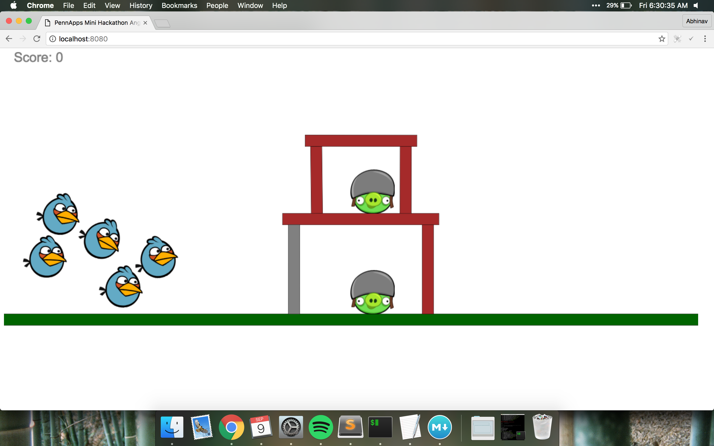
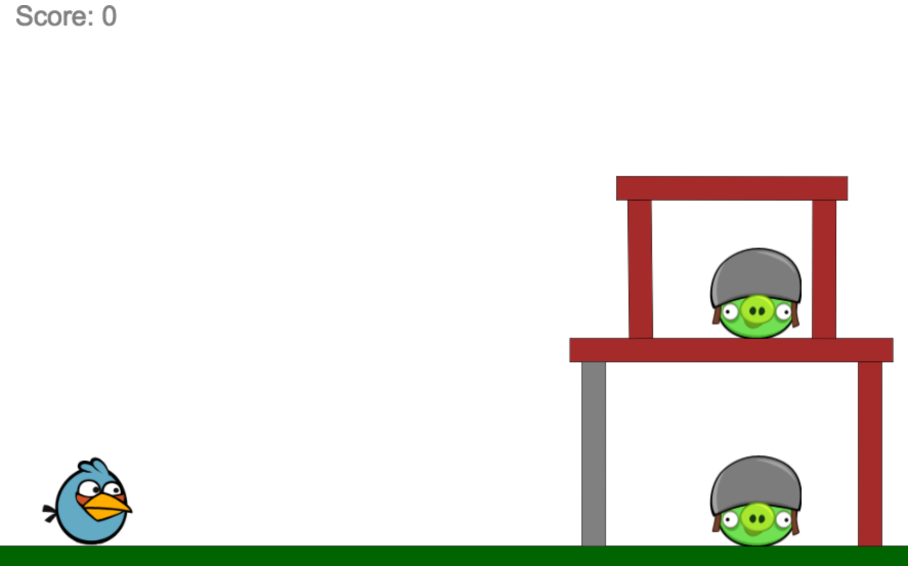

# PennApps-Mini-Hackathon: Angry Birds

A mini-project for a mini-hackathon


## Overview



This is a very basic implementation of Angry Birds in JavaScript. Currently, the implementation features several basic abilities of the 'Angry Birds' game including the ability for birds to have special abilities (e.g. this implementation has a default ability for the blue bird to split into 3). Also there are multiple block types and of course the pigs, all of which break in response to collisions. 

Currently Boxbox is being used to calculate the physics with javascript and handle collision logic. The app uses webpack to condense all the JavaScript files inside of the `components/` directory to the single `app.js` file. The `lib/` directory contains the scripts which the physics rely upon. The `styles/` directory includes a basic style sheet.

This write up was made for PennApps XIV by Abhinav Suri as part of the mini-hackathon program. The aim of this project is to provide a base for beginner/intermediate programmers to implement some new features on top of an existing codebase.

## Setup


We assume you have some knowledge of command line. Please install Node so you can get access to npm. 

After installing node, download this repository and run `npm install` to get all the dependencies this project requires onto your local machine. We will be using some ES6 in this project as appropriate (the boxbox physics simulator has a lot of parts that are still only ES5 compatible right now). 

After that you can run `npm run start:dev` to start a webpack build and load the page. You should see a working implementation at localhost:8080 or whatever the equivalent is for your computer.



Also note that `npm run build` will condense all the app files into the single `app.js` file. This should only be run at the end.

## Part 1: index.html and `<canvas>`

First if you haven't used HTML before, go ahead and move over to Codecademy's excellent HTML, CSS, and JS tutorials. 

Our webpage is incredibly simple. Most of our work will be done inside of a `<canvas>` element.

```html
<canvas id="game" width=1400 height=900>
    Text that you see if you don't support Canvas :(
</canvas>
```
In browsers < IE 8, the `<canvas>` element does not appear due to the fact that those versions did not support HTML5 at the time. So, any text within a canvas will not show on any modern browsers, but will show on browsers that have canvas elements hidden/disabled or browsers that are old and not updated to handle HTML5 tags.

Looking at `index.html` we can see the canvas element is the only part of the page and it takes up a large part of it. There are certainly ways to adaptively size a canvas, but those can just make it complicated to position elements. 

Note we also include the `app.js` script even though all the scripts that we actually code are within the `components` folder. This is because, while we are running `npm run start:dev`, we are actually getting files dynamically packaged from webpack-dev-server. I'll discuss this more later on. But basically the app.js file isn't updated until you ask it to be with a `npm run build`.

The other tags on this page are rather self explanatory and it is a fairly bare page, but more than enough for what we need.

